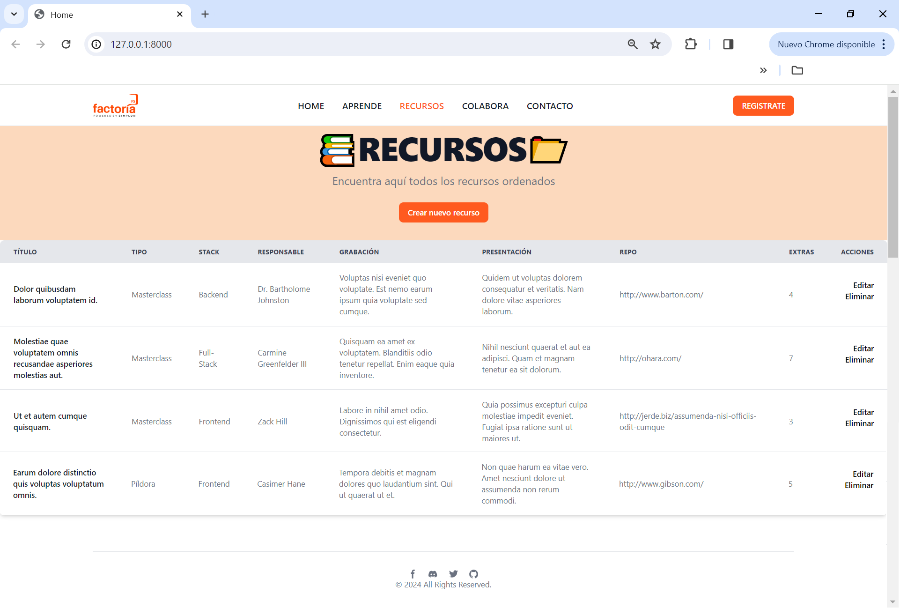

# :open_book: Gestor de Recursos <br>

Resource manager developed in PHP using the framework Laravel, that allows you to enter, modify and delete different resources.

## :camera: Preview



## ⚙️ Technologies

[](https://skillicons.dev)
<br>


## :computer: Get Started:

* Clone this repository:
```
git clone https://github.com/claudiaglez/P09_GestorDeRecursos.git
```

* Navigate to the directory:
```
cd P09_GestorDeRecursos
```

* Install PHP dependencies
```
composer install
```

* Install Node.js dependencies
```
npm install
```

* Configure the environment file
```
cp .env.example .env
```

* Generates the Laravel application key
```
php artisan key:generate
```

* Configure database
> [!WARNING]
> This is an example of the configuration of the database.
```
DB_CONNECTION=mysql
DB_HOST=127.0.0.1
DB_PORT=3306
DB_DATABASE=database_name
DB_USERNAME=username
DB_PASSWORD=password
```
  
* Migrate the database
```
php artisan migrate
```

* Running the development server
```
php artisan serve
```

* Open your browser and visit
```
http://localhost:8000
```

* Enjoy! :sun_with_face:

## :open_hands: Contributions

Do you have any suggestion? Please, feel free to contact us or open an issue or pull request :star_struck:


 ## 👩‍💻 Authors

🧡 [Claudia González](https://www.linkedin.com/in/claudiaglezgarcia/)<br>
💛 [María Méndez](https://github.com/mariamf1985/)<br>
💙 [Ana Cecilia Reques](https://www.linkedin.com/in/ana-cecilia-reques/)<br>
💚 [Sharon Santamaría](https://github.com/sharonSofia)


                                            
